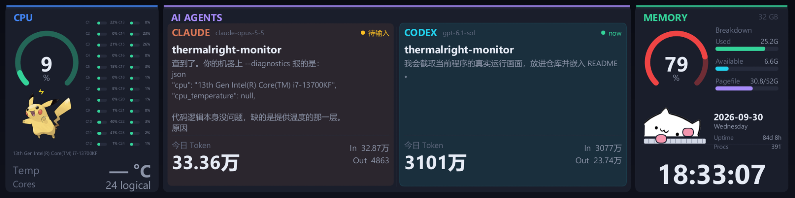

# win-thermalright-ai-monitor · Windows Rust 版

把利民 LCD 变成 **CPU / AI Agents / 内存** 实时仪表盘。功能参考 [mac-thermalright-ai-monitor](https://github.com/m1ng-li/mac-thermalright-ai-monitor)，使用 Rust 重写为 Windows 应用。没有 LCD 也能直接打开本机预览。

Windows 实机运行效果，显示实时系统指标、本地 AI 会话及 LCD 连接状态：



支持 Windows 10/11 x64，主要适配 Trofeo Vision 9.16 的 `0416:5408`、1920×480 LCD；兼容参考项目的 `5409` LY1 协议及已知分辨率配置。本机 `5408 / PM 65` 已通过握手和 60 帧 ACK 测试，Release 实测约 12.3 fps；其他配置仍需实机验证。

## 运行

便携包可直接运行 `win-thermalright-ai-monitor.exe`；后台运行用：

```powershell
.\win-thermalright-ai-monitor.exe --background
```

安装 Rust stable 的 MSVC 工具链和 Visual Studio Build Tools 的「使用 C++ 的桌面开发」，然后执行：

```powershell
cargo run --release
```

应用显示预览，自动尝试连接 LCD。右上工具栏可进入设置；关闭窗口后留在系统托盘，双击托盘图标重新打开，托盘菜单或工具栏的「退出」停止程序。

```powershell
cargo run --release -- --preview       # 保持本机预览入口
cargo run --release -- --demo          # 演示数据，仍可输出到 LCD
cargo run --release -- --background    # 连接 LCD 后隐藏到托盘
cargo run --release -- --snapshot dashboard.png --cores 16
cargo run --release -- --gif dashboard.gif --frames 48 --fps 12 --scale 2
cargo run --release -- --benchmark 120  # 真实 USB 吞吐测试，先退出常驻实例
cargo run --release -- --diagnostics    # 查看真实系统指标和日志可用性，不打开 USB
```

`--snapshot`、`--gif` 始终使用演示数据，不打开窗口或 USB；`--scale` 是 GIF 的缩小倍数。`--benchmark` 会向 LCD 写入演示帧，打印实际帧率。

构建便携包：

```powershell
.\packaging\build.ps1
# dist/win-thermalright-ai-monitor/win-thermalright-ai-monitor.exe
```

便携包仅包含 `win-thermalright-ai-monitor.exe`、`README.md`、`LICENSE` 和 `THIRD_PARTY.md`。libusb、SQLite 和桌宠图片都内嵌到程序；字体默认读取 Windows 自带的微软雅黑，无需单独放 DLL 或素材目录。

## LCD 连接

1. 连接 LCD 的 USB 线，并退出官方 TRCC 等会占用设备的程序。
2. 在设备管理器确认目标设备的硬件 ID 为 `USB\VID_0416&PID_5408` 或 `5409`。
3. 若设备尚未使用 WinUSB，可通过 [Zadig](https://zadig.akeo.ie/) 为**这个 LCD 的厂商 Bulk 接口**安装 WinUSB。务必按硬件 ID 选择目标，不要改动其他 USB 设备。
4. 重新运行应用。底部状态栏显示连接结果；拔插后每 3 秒自动重试。

替换目标接口驱动可能影响官方 TRCC；需要使用官方软件时，在设备管理器恢复原来的驱动。应用本身不安装或替换驱动。遇到画面倒置，在设置中切换「LCD 旋转 180°」。

USB 实现沿用参考项目的 2048 字节握手、496 字节 JPEG 数据块、LY 四块补齐、4096 字节批量传输和帧 ACK。JPEG 自动降质量以保持在 650 KB 内；按设备握手给出的分辨率缩放。未知设备配置会显示错误。

## 显示内容

布局对齐参考仪表盘：圆角面板和顶部色条、270° 弧形仪表、横向核心条、Agent 呼吸背景、底部大号 Token 与额度进度条。皮卡丘位于 CPU 仪表下方，敲键盘的 Bongo Cat 位于内存面板的时钟上方。

| 面板 | Windows 实现 |
|---|---|
| CPU | 总占用率、逻辑核心横条、处理器名称、可选温度、随负载变化的皮卡丘；17–32 核用双列，更多核心按标注的索引范围分组取平均 |
| AI Agents | 默认左侧 CLAUDE、右侧 CODEX；左右列可分别选择 Claude / Codex / Cursor；项目、模型、最后消息、Markdown 表格、当前计划、工作呼吸动画、完成/等待提醒 |
| Token | 本地自然日的 In/Out；Claude 包含缓存创建与缓存读取，消息 ID 去重；Codex 用累计用量差值避免重复事件计数；Cursor 显示「—」 |
| Codex 额度 | 从所有本地会话选最新 `rate_limits.primary`，显示剩余比例及重置倒计时，标注「日志读数」 |
| Cursor | 可从本地 SQLite 只读获取当前会话的上下文使用率和模型；没有对应表或数据时省略 |
| 内存 | 占用率仪表、总量、已用/可用/页面文件横条；大号时钟、日期、开机时长、进程数 |

Windows 不直接提供 macOS 的 Active/Wired/Compressed、P/E 核标签及 load average，因此核心标为 C1、C2 等，底部显示逻辑核心数，内存使用 Used/Available/Pagefile；Pagefile 横条表示已用量占页面文件总量的比例。CPU 温度缺失时显示「—」，不使用 ACPI thermal zone 冒充 CPU 温度。

要显示温度，运行 [LibreHardwareMonitor](https://github.com/LibreHardwareMonitor/LibreHardwareMonitor) 并启用其 WMI 提供程序；本应用只读查询 `ROOT\LibreHardwareMonitor` 的 CPU Temperature 传感器，也支持 OpenHardwareMonitor。传感器权限和支持情况取决于监控工具与主板。

渲染与 USB 在后台线程执行，指标独立采集。活动动画时目标约 15 fps，空闲 2 fps；实际帧率受 CPU/JPEG 编码和 USB 限制。设置可启用跨午夜的夜间熄屏（默认关闭，预设 18:30–09:00），夜间 LCD 输出黑帧，本机继续预览。

设置中的「跟随系统熄屏/亮屏」默认启用，可随时关闭。启用后 LCD 跟随 Windows 显示器电源状态：系统熄屏时输出黑帧，系统亮屏时恢复实时画面，隐藏到托盘后仍然生效。系统仅调暗屏幕时保持显示；如果仍处于启用的夜间熄屏时段，则继续保持黑屏。这里的熄屏与夜间模式相同，使用黑帧，不关闭 LCD 背光或切断 USB 电源。

## 日志和设置

默认读取当前用户目录，可用 `--agent-home E:\some-home` 改成另一个日志根目录：

| Agent | 只读数据源 |
|---|---|
| Claude | `%USERPROFILE%\.claude\projects\*\*.jsonl` |
| Codex | `%USERPROFILE%\.codex\sessions\**\*.jsonl` |
| Cursor | `%USERPROFILE%\.cursor\projects\*\agent-transcripts\**\*.jsonl` |
| Cursor 上下文 | `%APPDATA%\Cursor\User\globalStorage\state.vscdb` |
| Cursor 模型 | `%USERPROFILE%\.cursor\ai-tracking\ai-code-tracking.db` |

仅消费完整 JSONL 行，保存读取偏移，处理截断并在本地午夜重新计算当天用量。扫描当天活动的日志和最近 8 个会话，避免反复读取整个历史目录；当天用量依照事件时间戳按本地自然日计算。Codex 使用日志事件时间选择最新主会话，避免 Windows 持续写入时文件修改时间滞后；Guardian 等辅助会话计入 Token 汇总，但不会替换面板的项目和消息。工作状态是日志推断：最近 90 秒内有运行信号视为工作中；完成或等待输入时闪烁约 10 秒。日志格式可能随各助手版本改变，缺失字段会被忽略。

**数据采集不联网，不读取 OAuth 凭据。** 参考项目的当前代码会联网查询 Codex 额度；这里保留本地日志模式，因此额度可能滞后。没有近期日志读数时不显示额度。

配置默认保存在 `%APPDATA%\win-thermalright-ai-monitor\config\settings.json`，实际路径也显示在设置窗口中。可通过 `--config path.json` 指定。自定义中文字体：

```json
{
  "left": "Claude",
  "right": "Codex",
  "brightness": 1,
  "rotate": true,
  "follow_system_display": true,
  "night_enabled": false,
  "night_start": 1110,
  "night_end": 540,
  "font": "C:/Windows/Fonts/msyh.ttc"
}
```

设置中的登录自启写入当前用户的 `HKCU\Software\Microsoft\Windows\CurrentVersion\Run`，启动项名称为 `win-thermalright-ai-monitor`，启动参数为 `--background`。启用前建议把便携包放到固定位置；关闭开关会删除本应用的启动项。单实例互斥使用 `Local\win-thermalright-ai-monitor`，避免两个本应用同时访问 LCD。

## 开发验证

```powershell
cargo fmt --check
cargo clippy --all-targets --locked -- -D warnings
cargo test --locked
```

测试覆盖 LY 分包边界与握手配置、JSONL 半行读取、Token 去重、日志截断、计划生命周期和跨午夜时段。PNG/GIF 导出可以验证无硬件渲染；USB 帧 ACK、驱动兼容、睡眠唤醒与温度需要在目标设备上验证。

代码按 `agents`、`metrics`、`render`、`protocol`、`usb`、`app`、`config` 划分。素材来源和许可证见 [THIRD_PARTY.md](THIRD_PARTY.md)。
