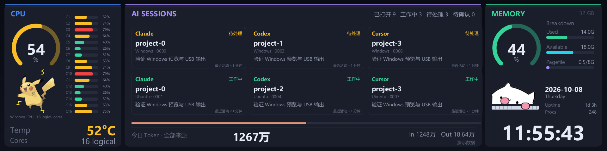

# win-thermalright-ai-monitor · Windows Rust 版

把利民 LCD 变成 **CPU / AI Agents / 内存** 实时仪表盘。功能参考 [mac-thermalright-ai-monitor](https://github.com/m1ng-li/mac-thermalright-ai-monitor)，使用 Rust 重写为 Windows 应用。没有 LCD 也能直接打开本机预览。

多会话界面示例（演示数据，由 Rust 渲染器导出）：



支持 Windows 10/11 x64，主要适配 Trofeo Vision 9.16 的 `0416:5408`、1920×480 LCD；兼容参考项目的 `5409` LY1 协议及已知分辨率配置。已实机验证 `5408 / PM 65`；其他设备配置需在目标设备上验证。

## 运行

便携包可直接运行 `win-thermalright-ai-monitor.exe`；后台运行用：

```powershell
.\win-thermalright-ai-monitor.exe --background
```

安装 Rust stable 的 MSVC 工具链和 Visual Studio Build Tools 的「使用 C++ 的桌面开发」，然后执行：

```powershell
cargo run --release
```

应用显示预览，自动尝试连接 LCD。右上工具栏或托盘菜单可打开独立的原生设置窗口，可拖到预览外或另一块屏幕；再次打开会唤起已有设置窗口。关闭设置只关闭设置，关闭或隐藏预览时设置也一起关闭。关闭预览后留在系统托盘，双击托盘图标重新打开，托盘菜单或工具栏的「退出」停止程序。

Windows 预览按需运行在独立进程中；关闭窗口会退出预览进程，释放窗口、纹理和显卡驱动缓存。后台继续采集、轮播和输出 LCD，并接收系统电源通知。打开预览期间会看到两个同名进程，查看内存时需合计两者。

预览启动失败或崩溃时，后台继续运行；启动失败会有限重试，也可从托盘重新打开。退出程序时先正常关闭预览，无响应超过 1 秒才终止预览进程。设置与会话状态按变化传输，最长约 1 秒同步到预览，画面独立更新。

```powershell
cargo run --release -- --preview       # 保持本机预览入口
cargo run --release -- --demo          # 演示数据，仍可输出到 LCD
cargo run --release -- --background    # 连接 LCD 后隐藏到托盘
cargo run --release -- --snapshot dashboard.png --cores 16
cargo run --release -- --gif dashboard.gif --frames 48 --fps 12 --scale 2
cargo run --release -- --benchmark 120  # 真实 USB 吞吐测试，先退出常驻实例
cargo run --release -- --diagnostics    # 查看真实系统指标和日志可用性，不打开 USB
cargo run --release -- --diagnostics --diagnostics-seconds 35 # 观察持续采集与首次回填结果
```

`--snapshot`、`--gif` 始终使用演示数据，不打开窗口或 USB；`--scale` 是 GIF 的缩小倍数。`--benchmark` 会向 LCD 写入演示帧，打印实际帧率。

构建便携包：

```powershell
.\packaging\build.ps1
# dist/win-thermalright-ai-monitor/win-thermalright-ai-monitor.exe
```

便携包包含 `win-thermalright-ai-monitor.exe`、`README.md`、`LICENSE` 和 `THIRD_PARTY.md`。libusb、SQLite 和桌宠图片都内嵌到程序；字体默认读取 Windows 自带的微软雅黑，无需单独放 DLL 或素材目录。

使用已编译的其他输出文件打包时，可传入 `packaging/build.ps1 -SkipBuild -ExecutablePath <exe路径>`。

## LCD 连接

1. 连接 LCD 的 USB 线，并退出官方 TRCC 等会占用设备的程序。
2. 在设备管理器确认目标设备的硬件 ID 为 `USB\VID_0416&PID_5408` 或 `5409`。
3. 若设备尚未使用 WinUSB，可通过 [Zadig](https://zadig.akeo.ie/) 为**这个 LCD 的厂商 Bulk 接口**安装 WinUSB。务必按硬件 ID 选择目标，不要改动其他 USB 设备。
4. 重新运行应用。底部状态栏显示连接结果；拔插后每 3 秒自动重试。

替换目标接口驱动可能影响官方 TRCC；需要使用官方软件时，在设备管理器恢复原来的驱动。应用本身不安装或替换驱动。遇到画面倒置，在设置中切换「LCD 旋转 180°」。

USB 实现沿用参考项目的 2048 字节握手、496 字节 JPEG 数据块、LY 四块补齐、4096 字节批量传输和帧 ACK。JPEG 自动降质量以保持在 650 KB 内；按设备握手给出的分辨率缩放。未知设备配置会显示错误。

## 显示内容

布局保留圆角面板、270° 弧形仪表和横向核心条；中间 AI 面板使用六卡总览或双栏详情，底部显示全部来源的今日 Token。皮卡丘位于 CPU 仪表下方，敲键盘的 Bongo Cat 位于内存面板的时钟上方。

| 面板 | Windows 实现 |
|---|---|
| CPU | 总占用率、逻辑核心横条、处理器名称、可选温度、随负载变化的皮卡丘；17–32 核用双列，更多核心按标注的索引范围分组取平均 |
| AI 会话 | Windows 与运行中 WSL2 合并；六卡总览 / 双栏详情、来源和 Agent 筛选、分段分页器、8 秒轮播；同项目多个会话独立显示，奇数末页扩展为单栏 |
| Token | 本地自然日的 In/Out；Claude 包含缓存创建与缓存读取，消息 ID 去重；Codex 用累计用量差值避免重复事件计数；Cursor 显示「—」 |
| Codex 额度 | 桌面会话展开信息保留该来源的额度日志读数；账户归属未知时不合并不同来源的额度 |
| Cursor | 可从本地 SQLite 只读获取当前会话的上下文使用率和模型；没有对应表或数据时省略 |
| 内存 | 占用率仪表、总量、已用/可用/页面文件横条；大号时钟、日期、开机时长、进程数 |

Windows 不直接提供 macOS 的 Active/Wired/Compressed、P/E 核标签及 load average，因此核心标为 C1、C2 等，底部显示逻辑核心数，内存使用 Used/Available/Pagefile；Pagefile 横条表示已用量占页面文件总量的比例。CPU 温度缺失时显示「—」，不使用 ACPI thermal zone 冒充 CPU 温度。

要显示温度，运行 [LibreHardwareMonitor](https://github.com/LibreHardwareMonitor/LibreHardwareMonitor) 并启用其 WMI 提供程序；本应用只读查询 `ROOT\LibreHardwareMonitor` 的 CPU Temperature 传感器，也支持 OpenHardwareMonitor。传感器权限和支持情况取决于监控工具与主板。

渲染与 USB 在后台线程执行，指标独立采集。活动动画时目标约 15 fps，空闲 2 fps；实际帧率受 CPU/JPEG 编码和 USB 限制。设置可启用跨午夜的夜间熄屏（默认关闭，预设 18:30–09:00），夜间 LCD 输出黑帧，本机继续预览。

设置中的「跟随系统熄屏/亮屏」默认启用，可随时关闭。启用后 LCD 跟随 Windows 显示器电源状态：系统熄屏时输出黑帧，系统亮屏时恢复实时画面，隐藏到托盘后仍然生效。系统仅调暗屏幕时保持显示；如果仍处于启用的夜间熄屏时段，则继续保持黑屏。这里的熄屏与夜间模式相同，使用黑帧，不关闭 LCD 背光或切断 USB 电源。

## 日志和设置

默认读取当前用户目录，可用 `--agent-home E:\some-home` 改成另一个日志根目录：

| Agent | 只读数据源 |
|---|---|
| Claude | `%USERPROFILE%\.claude\sessions\<pid>.json` 与 `projects\*\*.jsonl` |
| Codex | `%USERPROFILE%\.codex\sessions\**\*.jsonl` |
| Cursor | `%USERPROFILE%\.cursor\projects\*\agent-transcripts\**\*.jsonl` |
| Cursor 上下文 | `%APPDATA%\Cursor\User\globalStorage\state.vscdb` |
| Cursor 模型 | `%USERPROFILE%\.cursor\ai-tracking\ai-code-tracking.db` |

会话是否打开由运行实例证明：Windows Codex 查询已确认进程持有的 rollout 文件；WSL2 在发行版内读取 `/proc`、进程启动时间和启动纪元。Claude 读取原生 `sessions/<pid>.json`，独立校验进程所属用户、PID 与启动标识，再按 `sessionId` 校验对应日志。仅有历史日志不会进入打开列表，无法关联的进程和过期证据显示“待确认”。Codex 的 Guardian / 子 Agent 不进入主会话列表，用量仍计入汇总。

Codex 共享 `app-server` 可同时持有多个主会话：每份校验过文件身份和元数据的 rollout 独立建卡。更新守护进程不进入列表；Windows 和 WSL2 通过 Unix socket 对端身份排除连接到已关联服务的重复 CLI 前端。Windows 只排除没有自持 rollout 的前端，并再次校验双方进程启动标识；验证失败时仍保留待确认项。普通 CLI 的多个主会话候选继续显示歧义，不按项目目录或修改时间猜测。已关联会话首次读取日志优先于历史用量回填。

JSONL 只消费完整行，按文件身份维护偏移，处理替换、截断和本地午夜重算。活跃实例关联的旧日志不受最近 8 个日志回退限制。今日用量按 Windows 本地日期汇总并按事件身份去重，包含已关闭会话；筛选和切页不改变统计。缺失来源、坏记录和未完成回填会标记“部分来源 / 正在补齐”。缺少稳定事件身份的导入或 fork，跨来源去重仍有覆盖限制。

WSL2 的最新会话事件与今日用量分别读取，工作状态不等待历史回填。大记录只缩短传输的显示文本，读取位置仍按原文件字节推进；事件身份和数值用量保留。首次回填期间加快采集，完成后恢复常规间隔。没有当天日志且没有运行会话的来源显示“无可监控会话”，不回放旧历史。

完成一轮任务属于闲置；明确批准请求属于待处理。只有日志推断时，工作信号静默超过 90 秒后变为未知，不据此判断关闭。Claude 的原生 `busy` / `idle` 状态随进程身份持续验证，长时间没有新消息也可保留工作状态；未识别的状态回退到日志推断。

WSL2 默认探测运行中的发行版和默认用户，额外用户可在 `agents.extra_wsl_users` 配置。来宾需要 Python 3；没有 Python、权限不足或连接失败时显示来源错误。执行前再次检查运行状态，但 `wsl.exe` 仍存在停止竞态，无法绝对保证不重新拉起刚停止的发行版。`--agent-home` 继续只替换 Windows 日志根目录；Codex 同时支持 `CODEX_HOME` 和实例持有的实际日志路径；Claude 支持运行进程的 `CLAUDE_CONFIG_DIR`。

**数据采集不联网，不读取 OAuth 凭据。** 参考项目的当前代码会联网查询 Codex 额度；这里保留本地日志模式，因此额度可能滞后。没有近期日志读数时不显示额度。

配置默认保存在 `%APPDATA%\win-thermalright-ai-monitor\config\settings.json`，实际路径也显示在设置窗口中。可通过 `--config path.json` 指定。

设置由后台统一保存，通过同目录临时文件原子替换；保存失败保留上一次配置，并通知预览恢复旧设置。预览、IPC 和电源通知初始化错误记录到配置文件同目录的 `preview.log`，轮转到 `preview.log.1`，每份最多 256 KiB。字体共享冲突时使用自有字节副本；辅助字体不可用时回退到常规字体。

自定义中文字体：

```json
{
  "agents": {
    "windows_enabled": true,
    "wsl_running_enabled": true,
    "wsl_default_user": true,
    "extra_wsl_users": []
  },
  "agent_view": {
    "mode": "auto",
    "agent_filter": "all",
    "origin_filter": "all",
    "auto_rotate": false,
    "rotate_interval_seconds": 8
  },
  "brightness": 1,
  "rotate": true,
  "follow_system_display": true,
  "night_enabled": false,
  "night_start": 1110,
  "night_end": 540,
  "font": "C:/Windows/Fonts/msyh.ttc"
}
```

设置中的登录自启写入当前用户的 `HKCU\Software\Microsoft\Windows\CurrentVersion\Run`，启动项名称为 `win-thermalright-ai-monitor`，启动参数为 `--background`。启用前建议把便携包放到固定位置；关闭开关会删除本应用的启动项。单实例互斥使用 `Local\win-thermalright-ai-monitor`，避免两个本应用同时访问 LCD。

## 多会话与原生会话登记

首次运行自动推荐布局：1–2 个已确认打开的会话用详情，3 个及以上用总览。选择手动模式后保存偏好；没有固定会话或左右绑定。预览点击总览卡片进入对应详情页，点击分页器暂停轮播。托盘隐藏时继续轮播，夜间或系统熄屏时暂停，亮屏后重新计时。

Claude 通过 CLI 自带的原生登记关联 Windows / WSL 会话，监控程序只读采集。需要 CLI 提供 `sessions/<pid>.json` 中的 `pid`、`sessionId` 和 `procStart`；Windows 启动标识使用 FILETIME，Linux 使用 `/proc/<pid>/stat` 的启动 tick。登记缺失、身份冲突或日志身份无法校验时显示待确认，不按项目目录猜测。

登记文件可能在异常退出后残留，进程身份才是打开依据。`updatedAt` 不是心跳，不能用登记的修改时间判断关闭。`busy` 对应工作中、`idle` 对应闲置；明确的日志问题事件补充待处理状态。自定义 `CLAUDE_CONFIG_DIR` 中已关联会话及同目录的今日历史用量一并采集。

额外 WSL 用户的配置项为 `{"distro":"Ubuntu","user":"alice"}`；来源筛选保存稳定来源 ID。旧 `left` / `right` 设置会被忽略，新配置保留亮度、旋转、电源同步、夜间和字体设置，保存时移除旧字段。

可以导出不同布局和末页进行检查：

```powershell
cargo run -- --snapshot overview.png --agent-mode overview --demo-sessions 9
cargo run -- --snapshot last-page.png --agent-mode details --demo-sessions 9 --demo-page 4
cargo run -- --snapshot empty.png --demo-sessions 0
```

来源与会话的完整路径、PID、最后确认时间、错误、证据和额度日志读数位于“会话与来源状态”窗口。

## 开发验证

```powershell
cargo fmt --check
cargo clippy --all-targets --locked -- -D warnings
cargo test --locked
python -m unittest discover -s tests -p "test_*.py"
.\packaging\test-tray.ps1 # 先退出常驻实例；在交互式 Windows 桌面运行
```

PNG/GIF 导出可检查无硬件渲染；USB 帧 ACK、驱动兼容、睡眠唤醒与温度需要在目标设备上验证。

日志解析位于 `agents`，身份与状态归并 / 分页位于 `session`，来源调度位于 `monitor`，Windows / WSL2 探测位于 `probe`，Claude 原生登记校验位于 `src/probe/claude.rs`；系统指标、渲染与 USB 继续独立运行。素材来源和许可证见 [THIRD_PARTY.md](THIRD_PARTY.md)。
